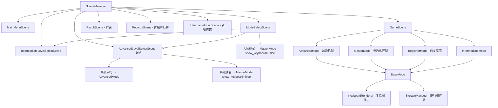

## 用户需求

对现有 Keyboard Trainer 打字练习游戏进行全面功能完善与优化，具体包括以下七个方向：

### 核心功能修复

- **初级模式键盘提示灯修复**：阶段介绍动画结束后，目标按键对应的键盘高亮灯应立即亮起，而非当前的不亮状态
- **错误点击后保留高亮**：按错键时，正确目标键持续高亮显示（不因错误点击而消失）
- **重复按键闪烁效果**：在初级模式中，对相同目标键连续出现时添加闪烁动画提示

### 模式结构重构

- **高级菜单增加子菜单**：新增"高级字母"（原有字母下落玩法）和"高级拼音"（将原大师模式的拼音输入挑战移至此处）两个子选项，菜单结构与中级模式保持一致
- **大师级别玩法升级**：移除虚拟键盘和手指指示图，仅显示下落汉字，无任何拼音提示，玩家需凭记忆输入正确拼音才能消除

### UI 优化

- **手指示意图布局修正**：优化左右手小指、无名指的相对位置排布，使示意图更符合真实手型，不再出现小指偏离过远的问题

### 记分与排行榜系统

- **JSON 成绩存储完善**：各游戏模式独立记录成绩，每条记录含用户名、分数和时间三个字段
- **用户名输入机制**：打破纪录时，在结果界面弹出输入框请用户主动填写用户名
- **排行榜完善**：成绩档案页按模式分组展示排行榜（前10名），显示排名、用户名、成绩、时间

### 游戏性增强

- **连续正确加速机制**：高级字母和高级拼音模式中，连续正确3次触发加速（`speed_bonus` 系数递增，最高不超过原速度的 30%），与现有降速惩罚机制协调运作
- **加速/减速系统协调**：加速后出错仍触发降速，降速后连续正确可以重新加速恢复

### 附加改进建议

- 大师模式隐藏拼音提示后，在界面顶部显示"盲打拼音模式"说明标语，增强用户认知
- `game_data.json` 中历史遗留的扁平键（"基础模式"等）与 `modes` 嵌套键并存，完善数据结构统一至 `modes` 层级下

## 产品概述

Keyboard Trainer 是一款以打字指法训练为核心目标的 Pygame 游戏，分初级/中级/高级/大师四个难度层级。本次改进旨在修复体验 Bug、扩充高级内容、强化成就系统，以提升科学性和可玩性。

## 核心功能

- 初级阶段训练：10 阶段循序渐进，键盘提示灯全程引导
- 中级打字练习：单词/短语/句子三种内容
- 高级字母下落：字母掉落切水果玩法，含加速/减速动态机制
- 高级拼音模式：将原大师拼音游戏迁移，保留键盘提示
- 大师盲打挑战：无键盘无提示，纯汉字下落，考验拼音记忆
- 排行榜系统：各模式前 10 名，展示用户名/分数/时间

## 技术栈

- **语言**：Python 3.8+
- **框架**：Pygame 2.0+
- **数据存储**：JSON 文件（`data/game_data.json`）
- **架构模式**：场景管理器 + 游戏模式继承体系（BaseMode → 各具体模式）

---

## 实现策略

### 1. 初级模式键盘提示灯修复

**根本原因**：`beginner_mode.py` 的 `_advance_to_next_stage()` 和 `_restart_current_stage()` 在切换阶段时调用了 `clear_highlight()`，但随后 `showing_stage_intro=True` 期间 `update()` 直接 `return`，导致阶段介绍动画结束后没有重新调用 `generate_target_key()` 产生高亮。

**修复方案**：在 `update()` 中，当 `showing_stage_intro` 从 `True` 变为 `False`（即 `stage_transition_timer <= 0`）时，立即调用 `generate_target_key()`。同时确保 `_advance_to_next_stage()` 和 `_restart_current_stage()` 不预先调用 `generate_target_key()`，由 intro 结束后统一触发。

**重复按键闪烁**：在 `KeyboardRenderer` 中新增 `blink_key(key_char, blink_count)` 方法，利用帧计数器在高亮色和暗色之间切换，在 `BeginnerMode` 中当新目标键与上一个相同时调用该方法。

### 2. 高级菜单重构

在 `scene_manager.py` 中新增 `AdvancedLevelSelectScene`，结构完全对齐 `IntermediateLevelSelectScene`，提供"高级字母"和"高级拼音"两个选项。`ModeSelectScene.start_advanced_mode()` 跳转至 `AdvancedLevelSelectScene` 而非直接进入游戏。

"高级拼音"复用 `MasterMode`，并通过参数 `show_keyboard=True` 区分（仍显示键盘和拼音提示）。"大师模式"则传入 `show_keyboard=False`、`show_pinyin_hint=False`，成为真正的盲打挑战。

### 3. 大师模式盲打改造

**方案**：在 `MasterMode.__init__()` 中增加 `show_keyboard` 和 `show_pinyin_hint` 参数（默认均为 False，即新大师行为；高级拼音调用时传 True）。重写 `render()` 方法，当 `show_keyboard=False` 时跳过 `super().render()`（从而不渲染虚拟键盘），改为渲染纯汉字游戏区域；`show_pinyin_hint=False` 时，`FallingChineseChar.render()` 不绘制拼音文字。同时在顶部显示"大师盲打模式"字样。

### 4. 手指示意图布局修正

**问题**：`_draw_hand()` 中拇指绘制在手掌最左边（左手 `x - thumb_width//2`）或最右边（右手 `x + hand_width - thumb_width//2`），位置不符合真实手型；4 根手指绘制时居中，导致小指视觉上与拇指分离过大。

**修正**：将拇指绘制位置改为从手掌底部斜出，调整 `thumb_y` 向下偏移，`thumb_x` 向手掌内侧偏移（左手向右，右手向左），并略微倾斜（用椭圆旋转或调整宽高比模拟角度）。同时收紧 4 根手指的起始 x，减少 `finger_gap`，整体让手形更紧凑自然。

### 5. 记分与排行榜系统

**数据结构扩展**：在 `storage.py` 的 `get_default_data()` 中，为每个模式的 `recent_results` 条目增加 `username` 字段；新增 `leaderboard` 列表（各模式独立，存储 `{username, score, date}` 前10名，按分数降序）。同时修复现有 JSON 中 `best_time: Infinity` 导致的序列化问题（改为 `None` 或 `999999`）。

**用户名输入**：新增 `UsernameInputScene`（或在 `ResultScene` 内嵌输入状态）：当本局成绩打破当前最高分时，展示输入框请求用户名，使用 `pygame.KEYDOWN` 字符累积方式实现文本输入（不依赖 IME），确认后调用 `storage_manager.update_leaderboard()`。

**排行榜渲染**：`RecordsScene` 增加按模式分页 Tab 展示，每个模式渲染 `leaderboard` 列表，以表格形式展示排名/用户名/分数/时间。

### 6. 加速机制

**结构**：在 `AdvancedMode` 和 `MasterMode` 中新增 `consecutive_correct`（连续正确计数）和 `speed_bonus`（加速系数，初始 1.0，上限 1.3）。命中3个正确后 `speed_bonus += 0.01`（每3连击增加1%），出错后 `speed_bonus` 重置为 1.0（而非乘以降速）。

**最终速度公式**：

```
actual_speed = base_time_speed * speed_penalty * speed_bonus
```

- `speed_penalty`：现有降速机制（连续出错降速，下限 0.5）
- `speed_bonus`：新增加速机制（连续正确加速，上限 2.0）
- 两个因子相互独立，加速和降速同时作用，确保协调

---

## 实现注意事项

- `game_data.json` 中已有扁平格式旧数据（"基础模式"等顶层键），`ensure_data_structure()` 需兼容处理，不破坏旧数据
- `best_time: Infinity` 在 JSON 序列化时会产生 `Infinity` 非标准值，需在 `save_data()` 中做替换处理（`float('inf')` → `999999`，读取时反向转换）
- 手指示意图修改只影响 `keyboard_renderer.py` 的 `_draw_hand()` 方法，不影响其他渲染逻辑
- `MasterMode` 的拼音提示修改需同步修改 `FallingChineseChar.render()` 的 `show_pinyin` 参数
- 排行榜输入用户名功能涉及 `scene_manager.py` 的 `ResultScene` 状态机扩展，需谨慎处理 `KEYDOWN` 事件与游戏事件的隔离
- 各模式 `get_mode_name()` 需要区分"高级字母"和"高级拼音"与原"大师模式"，以便 `save_record()` 写入正确的 key
- `speed_bonus` 应在 `reset_game()` 中初始化，确保每局独立

---

## 架构设计



---

## 目录结构

```
keyboard_trainer/
├── scene_manager.py          # [MODIFY] 新增 AdvancedLevelSelectScene；ResultScene 内嵌用户名输入逻辑；RecordsScene 改为分页排行榜
├── config.py                 # [MODIFY] 新增加速相关配置常量 SPEED_BONUS_MAX/SPEED_BONUS_STEP/SPEED_BONUS_THRESHOLD
├── game_modes/
│   ├── base_mode.py          # [MODIFY] save_record() 传递 username 参数；check_new_record() 返回比较结果
│   ├── beginner_mode.py      # [MODIFY] 修复 showing_stage_intro 结束后重新调用 generate_target_key()；新增闪烁效果逻辑
│   ├── advanced_mode.py      # [MODIFY] 新增 consecutive_correct 和 speed_bonus 加速机制
│   └── master_mode.py        # [MODIFY] 新增 show_keyboard/show_pinyin_hint 参数；调整 render() 方法
├── keyboard/
│   └── keyboard_renderer.py  # [MODIFY] 修正 _draw_hand() 拇指和手指排列位置；新增 blink_key() 方法
├── data/
│   └── storage.py            # [MODIFY] get_default_data() 增加 leaderboard 字段和 username；update_leaderboard() 新方法；修复 Infinity 序列化
└── content/
    └── chinese_chars.py      # [可选 MODIFY] 若需扩充汉字词库以增加大师模式难度
```